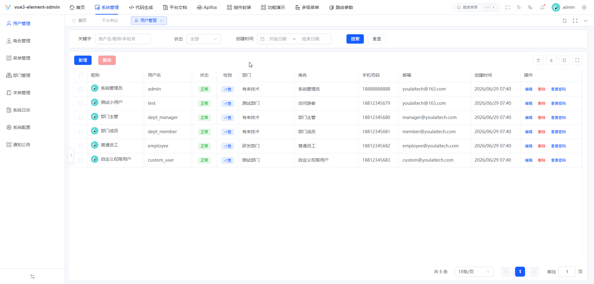

<div align="center">

#  youlai-nest

**NestJS 企业级权限管理系统后端**

[](https://nodejs.org/)
[](https://nestjs.com/)
[](LICENSE)
[](https://gitee.com/youlaiorg/youlai-nest/stargazers)
[](https://github.com/youlaitech/youlai-nest)

</div>


<div align="center">

[](https://vue.youlai.tech)
[](https://app.youlai.tech)
[](https://www.youlai.tech/docs/server/nestjs/)

</div>

## 项目简介

**youlai-nest** 是一套基于 NestJS 的企业级权限管理系统后端，配套前端 [vue3-element-admin](https://gitee.com/youlaiorg/vue3-element-admin) 和移动端 [youlai-app](https://gitee.com/youlaiorg/youlai-app)，并提供 **7 种语言实现**（Java / Node.js / Go / Python / PHP / C# / Rust），共享同一套 API 规范与数据库结构。适用于企业中后台管理系统的学习参考与二次开发。

## 核心特性

- 🔐 **安全体系** — JWT + Redis Token 双会话模式、令牌续期、多端互斥
- 🛡️ **细粒度权限** — RBAC 权限模型，菜单/按钮/接口统一治理
- ⚡ **代码生成器** — 一键生成前后端 CRUD 代码
- 📦 **模块齐全** — 用户、角色、菜单、部门、字典、文件、消息中心、操作日志
- 🔌 **实时通信** — SSE 推送：在线用户数、字典同步、通知广播
- 🌐 **多语言生态** — 与其它语言版本共享 API 规范与数据库结构

## 系统预览

**PC 端**

<table align="center">
  <tr>
    <td></td>
    <td></td>
  </tr>
  <tr>
    <td></td>
    <td></td>
  </tr>
  <tr>
    <td></td>
    <td></td>
  </tr>
</table>

**移动端**

<table align="center">
  <tr>
    <td></td>
    <td></td>
    <td></td>
    <td></td>
  </tr>
</table>

## 快速开始

**环境要求**：Node.js 20+ · pnpm · MySQL 8.0+ · Redis 7.x+

1. 克隆项目：`git clone https://gitee.com/youlaiorg/youlai-nest.git`
2. 导入数据库：`sql/mysql/youlai_admin.sql`
3. 修改配置（可选，默认已配置线上只读数据源）：`.env.dev`
4. 安装依赖：`pnpm install`

5. 启动服务：

   **方式一：WebStorm 启动（推荐）**
   用 WebStorm 打开项目，等待依赖索引完成，运行 `start:dev` 启动配置即可。

   **方式二：命令行启动**
   ```bash
   pnpm run start:dev
   ```
   启动后访问 [http://localhost:8000/api-docs](http://localhost:8000/api-docs)，能打开接口文档即说明后端已正常运行。

6. 启动前端（可选）：
   如需可视化操作界面，启动配套前端 [vue3-element-admin](https://gitee.com/youlaiorg/vue3-element-admin)，访问 [http://localhost:3000](http://localhost:3000)，使用 `admin` / `123456` 登录。

> 更多内容详见官方文档：[快速开始](https://www.youlai.tech/docs/server/nestjs/quick-start.html) · [部署指南](https://www.youlai.tech/docs/server/nestjs/deploy.html)

## 目录结构

```
youlai-nest/
├── src/                            # 核心业务源码
│   ├── main.ts                     # 应用入口
│   ├── app.module.ts               # 根模块
│   ├── auth/                       # 认证与鉴权模块
│   ├── system/                     # 系统核心模块（用户/角色/菜单/部门）
│   ├── codegen/                    # 代码生成模块
│   ├── file/                       # 文件管理模块
│   ├── message/                    # SSE 消息推送
│   ├── common/                     # 公共能力（守卫/拦截器/过滤器/异常）
│   ├── config/                     # 配置文件
│   └── types/                      # 类型定义
├── sql/                            # 数据库初始化脚本
├── .env                            # 基础环境配置
├── .env.dev                        # 开发环境配置
├── .env.prod                       # 生产环境配置
└── package.json                    # 项目配置与脚本
```

## 生态矩阵

**前端**

| 项目 | 技术栈 | 说明 | 更新状态 |
|:-----|:-------|:-----|:---------|
| [vue3-element-admin](https://gitee.com/youlaiorg/vue3-element-admin) | Vue 3 + Element Plus | PC 管理前端（主推） | ✅️ |
| [youlai-app](https://gitee.com/youlaiorg/youlai-app) | Vue 3 + UniApp | 移动端 App | ✅️ |

**后端**

| 项目 | 技术栈 | 说明 | 更新状态 |
|:-----|:-------|:-----|:---------|
| [youlai-boot](https://gitee.com/youlaiorg/youlai-boot) | Spring Boot + MyBatis-Plus | Java（主推） | ✅️ |
| [youlai-nest](https://gitee.com/youlaiorg/youlai-nest) | NestJS + TypeORM | Node.js | ✅️ |
| [youlai-gin](https://gitee.com/youlaiorg/youlai-gin) | Go + Gorm | Go | ✅️ |
| [youlai-django](https://gitee.com/youlaiorg/youlai-django) | Django + DRF | Python | ✅️ |
| [youlai-fastapi](https://gitee.com/youlaiorg/youlai-fastapi) | FastAPI + SQLAlchemy | Python | ✅️ |
| [youlai-laravel](https://gitee.com/youlaiorg/youlai-laravel) | Laravel + Eloquent | PHP | ✅️ |
| [youlai-think](https://gitee.com/youlaiorg/youlai-think) | ThinkPHP + ThinkORM | PHP | ✅️ |
| [youlai-aspnet](https://gitee.com/youlaiorg/youlai-aspnet) | ASP.NET Core + EF Core | C# | ✅️ |
| [youlai-axum](https://gitee.com/youlaiorg/youlai-axum) | Axum + SeaORM | Rust | ✅️ |

> 九种后端共享同一套 **RESTful API 规范** 和 **数据库结构**，前端可无缝切换。

**衍生版本**

| 项目 | 基于 | 类型 | 说明 | 更新状态 |
|:-----|:-----|:-----|:-----|:---------|
| [youlai-boot-tenant](https://gitee.com/youlaiorg/youlai-boot-tenant) | youlai-boot | 独立仓库 | 多租户 SaaS，租户隔离与租户配置 | ✅️ |
| [youlai-boot-flex](https://gitee.com/youlaiorg/youlai-boot-flex) | youlai-boot | 独立仓库 | 改用 MyBatis-Flex | ✅️ |
| [youlai-boot (db-pg)](https://gitee.com/youlaiorg/youlai-boot/tree/db-pg) | youlai-boot | 分支 | PostgreSQL 数据库分支 | ✅️ |
| [youlai-boot (multi-module)](https://gitee.com/youlaiorg/youlai-boot/tree/multi-module) | youlai-boot | 分支 | 多模块工程拆分 | ✅️ |
| [youlai-boot (spring-boot-3)](https://gitee.com/youlaiorg/youlai-boot/tree/spring-boot-3) | youlai-boot | 分支 | Spring Boot 3 兼容分支 | ✅️ |
| [youlai-nest (multi-tenant)](https://gitee.com/youlaiorg/youlai-nest/tree/multi-tenant) | youlai-nest | 分支 | 多租户 SaaS，租户隔离与租户配置 | ✅️ |

## 技术合作

本项目采用 [Apache License 2.0](LICENSE) 开源，可免费商用。欢迎在 [Issue](https://gitee.com/youlaiorg/youlai-nest/issues) 提交问题或反馈，也欢迎提交 [Pull Request](https://gitee.com/youlaiorg/youlai-nest/pulls) 共建。

如需技术支持、商务合作、二次开发、项目定制或私有化部署，可联系作者微信（见下方二维码）。

<table align="center">
  <tr>
    <td align="center">
      <br>
      <sub>公众号「有来技术」</sub>
    </td>
    <td>&nbsp;&nbsp;&nbsp;&nbsp;</td>
    <td align="center">
      <br>
      <sub>小程序「有来技术」</sub>
    </td>
    <td>&nbsp;&nbsp;&nbsp;&nbsp;</td>
    <td align="center">
      <br>
      <sub>添加作者微信</sub>
    </td>
  </tr>
</table>

<p align="center"><em>技术交流 · 问题反馈 · 商务合作</em></p>
